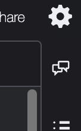
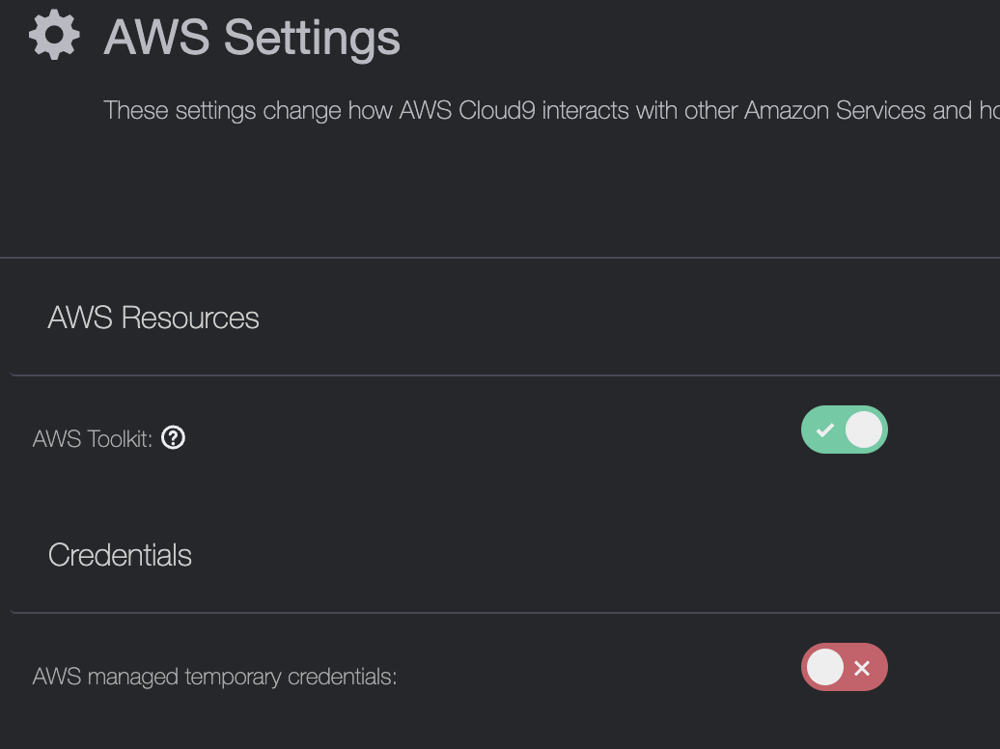
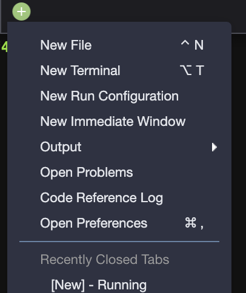
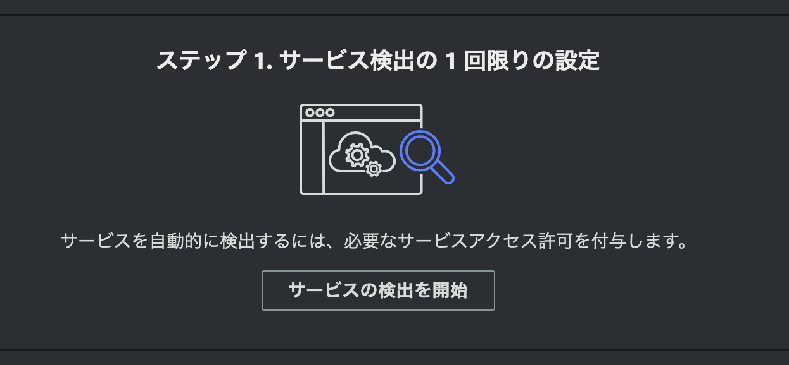
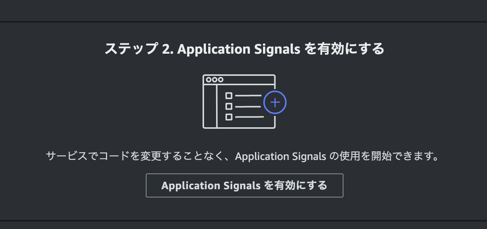

# Capter 1

## VPC, Cloud9, Instance Profile


## Cloud9 のインスタンスプロフェイルを変更する


## Cloud9 の設定を変更する







## Cloud9 の EBS ボリュームを拡張する

```bash
$ curl -H "X-aws-ec2-metadata-token: $TOKEN" http://169.254.169.254/latest/meta-data/
$ INSTANCE_ID=$(curl -H "X-aws-ec2-metadata-token: $TOKEN" http://169.254.169.254/latest/meta-data/instance-id)
$ VOLUME_ID=$(aws ec2 describe-instances --filters Name=instance-id,Values=$INSTANCE_ID | jq -r .Reservations[0].Instances[0].BlockDeviceMappings[0].Ebs.VolumeId)
$ echo $VOLUME_ID
## ここで ボリューム ID が表示されない場合は先へ進まないでください。手順を最初から見直してください。

$ aws ec2 modify-volume --size 20 --volume-id $VOLUME_ID

$ while true
do
  VOLUME_STATE=$(aws ec2 describe-volumes-modifications --volume-ids --volume-ids $VOLUME_ID | jq -r .VolumesModifications[0].ModificationState)
  if [ $VOLUME_STATE = "completed" ]; then
    echo "modify-volume is done. This machine will be rebooted."
    sudo reboot
    break
  else
    echo "waiting for volume modification..."
  fi
  sleep 10
done
```

Cloud9 マシンが再起動します。しばらく待ちます。  

```bash
$ df -h /
Filesystem      Size  Used Avail Use% Mounted on
/dev/nvme0n1p1   20G  7.1G   13G  36% /
## 20Gであることを確認
```

## minikube インストール

```bash
$ curl -LO https://storage.googleapis.com/minikube/releases/latest/minikube-latest.x86_64.rpm
$ sudo rpm -Uvh minikube-latest.x86_64.rpm
Verifying...                          ################################# [100%]
Preparing...                          ################################# [100%]
Updating / installing...
   1:minikube-1.33.1-0                ################################# [100%]

$ rm minikube-latest.x86_64.rpm 
```

## kubectl インストール

```bash
$ curl -LO "https://dl.k8s.io/release/$(curl -L -s https://dl.k8s.io/release/stable.txt)/bin/linux/amd64/kubectl"
$ sudo install -o root -g root -m 0755 kubectl /usr/local/bin/kubectl

$ echo 'source <(kubectl completion bash)' >>~/.bashrc
$ echo 'alias k=kubectl' >>~/.bashrc
$ echo 'complete -o default -F __start_kubectl k' >>~/.bashrc
$ source ~/.bashrc
```

```bash
$ k 
kubectl controls the Kubernetes cluster manager.

 Find more information at: https://kubernetes.io/docs/reference/kubectl/
〜〜省略〜〜
```


## minikube スタート

```bash
$ minikube start --cpus='2' --memory='6G'
* minikube v1.33.1 on Amazon 2023.5.20240624
〜〜省略〜〜
* Done! kubectl is now configured to use "minikube" cluster and "default" namespace by default
```

```bash
$ k get ns -A
NAME              STATUS   AGE
default           Active   26s
kube-node-lease   Active   26s
kube-public       Active   26s
kube-system       Active   26s

$ k get pod -A
NAMESPACE     NAME                               READY   STATUS    RESTARTS      AGE
kube-system   coredns-7db6d8ff4d-wjpm2           1/1     Running   0             51s
kube-system   etcd-minikube                      1/1     Running   0             65s
kube-system   kube-apiserver-minikube            1/1     Running   0             65s
kube-system   kube-controller-manager-minikube   1/1     Running   0             65s
kube-system   kube-proxy-r7vv2                   1/1     Running   0             51s
kube-system   kube-scheduler-minikube            1/1     Running   0             67s
kube-system   storage-provisioner                1/1     Running   1 (21s ago)   64s
```


## Application Signals 有効






