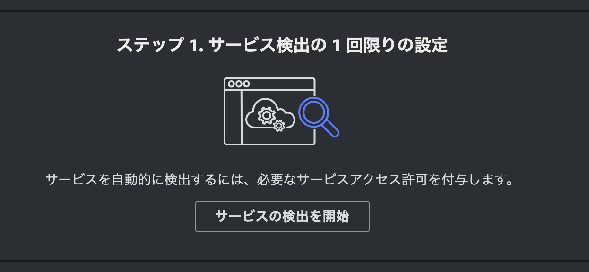

# Capter 1

この章は、ハンズオン前の準備を行います。  

## AWS リソースの作成

以下のリソースを作成してください。  

- VPC
  - 既存のものでも新規作成でも構いません
- パブリックサブネット
  - 1つ
  - 既存のものでも新規作成でも構いません
- EC2 インスタンスプロファイル
  - 1つ
  - 付与するポリシーは2つ
    - AmazonSSMManagedInstanceCore
    - CloudWatchAgentServerPolicy
- セキュリティグループ
  - 1つ
  - インバウンドは TCP 80 を許可
  - アウトバウンドは全て許可
- EC2 インスタンス
  - 1台
  - AMI は以下のいずれか
    - Amazon ECS-Optimized Amazon Linux 2023 (AL2023) x86_64 AMI
  - 上のインスタンスプロファイルとセキュリティグループをアタッチ
  - パブリックサブネットに配置
  - スペック -> 2vCPU, 8GB メモリー以上
  - EBS ボリューム -> 30GB 以上
- CloudWatch Logs ロググループ
  - 2つ
  - グループ名 -> dice-server
  - グループ名 -> petseach


Terraform も用意しています。[Terraform](../terraform)。  
CloudFormation も用意ｓちえます。 [CloudFormation](../cloudformation)。
手動でも Terraform でも CloudFormatin でもお好きな方法で作成してください。  

## EC2 インスタンスへのログイン

Session Manager でログインしてください。  


## リポジトリのクローン

作成した EC2 インスタンスに、ここのリポジトリをクローンしてください。  

```bash
$ cd ~
$ bash
$ sudo dnf install git -y

$ git clone https://github.com/YoshiiRyo1/opsjaws-application-signals-handson.git
$ cd opsjaws-application-signals-handson
$ ls
```

## Maven インストール

```bash
$ sudo dnf -y install java-17-amazon-corretto-devel maven

$ java --version
openjdk 17.0.12 2024-07-16 LTS  # 17.x.x が表示されること
OpenJDK Runtime Environment Corretto-17.0.12.7.1 (build 17.0.12+7-LTS)    # 17.x.x が表示されること
OpenJDK 64-Bit Server VM Corretto-17.0.12.7.1 (build 17.0.12+7-LTS, mixed mode, sharing)    # 17.x.x が表示されること

$ mvn --version
Apache Maven 3.8.4 (Red Hat 3.8.4-3.amzn2023.0.5)    # 3.x.xが表示されること
```

## Docker Compose インストール

```bash
$ sudo mkdir -p /usr/local/lib/docker/cli-plugins
$ sudo curl -L "https://github.com/docker/compose/releases/download/v2.29.1/docker-compose-$(uname -s)-$(uname -m)" -o /usr/local/lib/docker/cli-plugins/docker-compose
$ sudo chmod +x /usr/local/lib/docker/cli-plugins/docker-compose
$ docker compose version
Docker Compose version v2.29.1    # v2.29.1 が表示されること
```

## Sudo なしで Docker コマンドを実行

``` bash
$ sudo gpasswd -a $(whoami) docker
$ sudo chgrp docker /var/run/docker.sock
$ sudo service docker restart
```

上記コマンドを実行したら、一度 Session Manager からログアウトして再度ログインしてください。  


## Application Signals 有効

[CloudWatch](https://ap-northeast-1.console.aws.amazon.com/cloudwatch/home?region=ap-northeast-1#application-signals:services) 画面から、左ペインの **Application Signals** → **サービス** を選択します。  
初回アクセス時には以下のボタンが表示されます。**サービスの検出を開始** をクリックしてください。  




自分のアカウントでこのステップを初めて完了すると、**AWSServiceRoleForCloudWatchApplicationSignals** サービスリンクロールが作成されます。
このロールの詳細については、[CloudWatch Application Signals のサービスリンクロールのアクセス許可](https://docs.aws.amazon.com/ja_jp/AmazonCloudWatch/latest/monitoring/using-service-linked-roles.html#service-linked-role-signals) を参照してください。  

