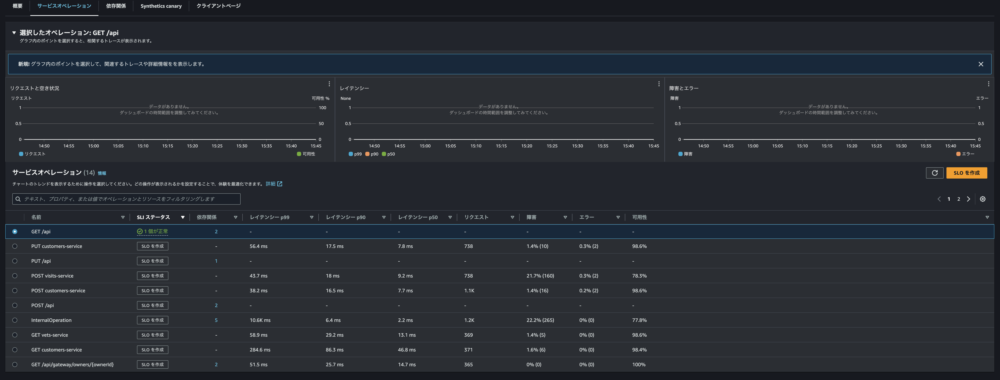

# Chapter 2

## この章の説明

Application Signals を理解するために、シンプルな1つのアプリケーションからシグナルを送信するデモを行います。  
EC2 上で3つのコンテナを立ち上げます。  

app は OpenTelemetry の Java サンプルアプリケーションです。  
ソースコードは [Docs/Language APIs & SDKs/Java/Instrumentation](https://opentelemetry.io/docs/languages/java/instrumentation/) にあります。  
app には [ADOT Java Agent](https://github.com/aws-observability/aws-otel-java-instrumentation/releases) を含めています。  

cw−agent は [CloudWatch Agent](https://gallery.ecr.aws/cloudwatch-agent/cloudwatch-agent) です。  
app から送信したトレースを受け取り、X-Ray 形式に変換して X-Ray へ送信します。  
また、トレースからメトリクスを生成し、[EMF](https://docs.aws.amazon.com/ja_jp/AmazonCloudWatch/latest/monitoring/CloudWatch_Embedded_Metric_Format_Specification.html)  に変換して CloudWatch Logs へ送信します。CloudWatch 側で自動的に CloudWatch Metrics に表示してくれます。    

adot は、[AWS Distro for OpenTelemetry Collector](https://aws-otel.github.io/docs/introduction) です。  
今回の構成では、app から送信されたログを受け取り、CloudWatch Logs へ送信する役割で使用しています。  


## dice のビルド

クローンしたリポジトリの `step2` ディレクトリに移動します。  
`build` コマンドでアプリケーションをビルドします。  

```bash
$ cd step2
$ docker compose build
```

出力からエラーが無いことを確認してください。  

## コンテナ起動

ビルドが正常終了したならば、コンテナを起動します。  

```bash
$ docker compose up -d
$ docker compose ps -a
NAME               IMAGE                                                         COMMAND                                                                SERVICE    CREATED         STATUS         PORTS
step2-adot-1       public.ecr.aws/aws-observability/aws-otel-collector:v0.40.0   "/awscollector --config=/etc/otel-config.yaml"                         adot       9 seconds ago   Up 8 seconds   2000/tcp, 4317/tcp, 55681/tcp, 0.0.0.0:4318->4318/tcp, :::4318->4318/tcp
step2-app-1        step2-app                                                     "/usr/bin/java -jar /app/build/libs/app.jar"                           app        9 seconds ago   Up 8 seconds   0.0.0.0:8080->8080/tcp, :::8080->8080/tcp
step2-cw-agent-1   public.ecr.aws/cloudwatch-agent/cloudwatch-agent:latest       "/opt/aws/amazon-cloudwatch-agent/bin/start-amazon-cloudwatch-agent"   cw-agent   9 seconds ago   Up 8 seconds   0.0.0.0:4316->4316/tcp, :::4316->4316/tcp
## STATUS が全て Up になっていることを確認
```

## リクエスト生成

`load_generate.sh` を実行して、app にリクエストを送信します。1回実行で10リクエストを生成します。何度が実行してみてください。  

```bash
$ chmod +x load_generate.sh 
$ ./load_generate.sh
[5,3,6,1,6,2,4,1,5,3,5,5] ##ランダムな数字が12個 x 10回 表示されます
```

## Application Insights の確認

マネジメントコンソールの CloudWatch 画面から、左ペインの **X-Ray トレース** → **トレース** を選択します。  
複数個のトレースが確認できるはずです。  


トレースの1つをクリックします。詳細画面に遷移します。  
ここでは関連するトレースマップ、トレースとスパン、トレースに関連したログが表示されています。  
該当する API のレスポンスタイムやどの処理が遅いのか、どの処理が呼び出されているのかなどが確認できます。  

  
<br />

子スパンの `RollController.index` をクリックしてみてください。  
概要、リソース、注釈、メタデータ、例外、SQL が表示されます。  
OpenTelemetry SDK、ADOT Java Agent、CloudWatch Agent によって付与された様々なメタデータが表示されています。  
ここを正確に、かつ、詳細に設定することで、トレースの分析が容易になります。  
このデモでは自動計装により様々なメタデータが付与されています。  

  
<br />

マネジメントコンソールの CloudWatch 画面から、左ペインの **Application Signals** → **サービス** を選択します。  
サービス欄に `dice-server` が表示されています。 app コンテナから送信したシグナルが Application Signals まで届いています。  

  
<br />

**dice-server** をクリックすると、サービスの健全性を測るために役立つメトリクスが表示されます。  
特に `サービスオペレーター` タブに表示される情報は SLI として利用可能です。  

  
<br />

CloudWatch Logs を見てみます。  
`/aws/application-signalgs/data` というロググループが作成されています。  
ここに CloudWatch Agent から EMF 形式でメトリクスが送信されています。  

  
<br />

そのメトリクスは CloudWatch Metrics に表示されています。  
カスタム名前空間 `ApplicationSignals` が作られます。Error、Latency、Fault などのメトリクスが表示されています。  

  

  


## コンテナ停止

コンテナを停止します。  

```bash
$ docker compose down
```


