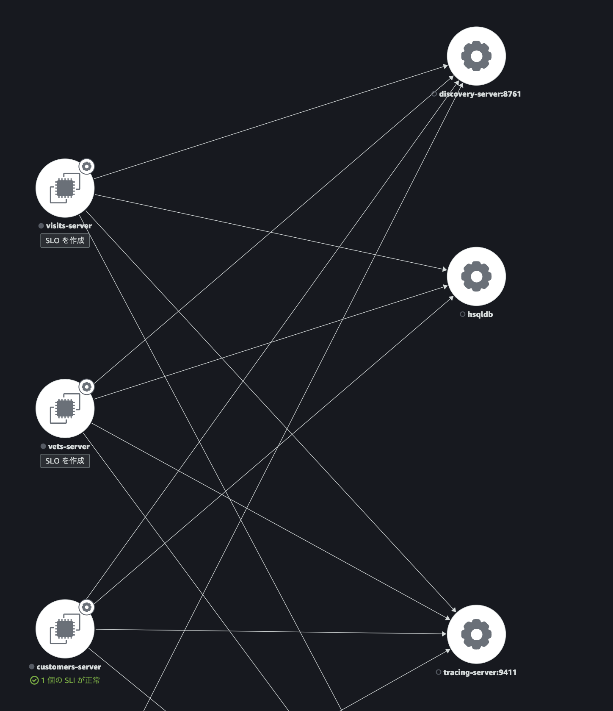
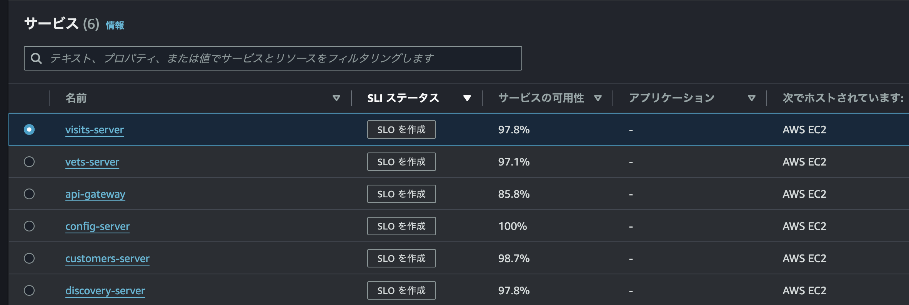
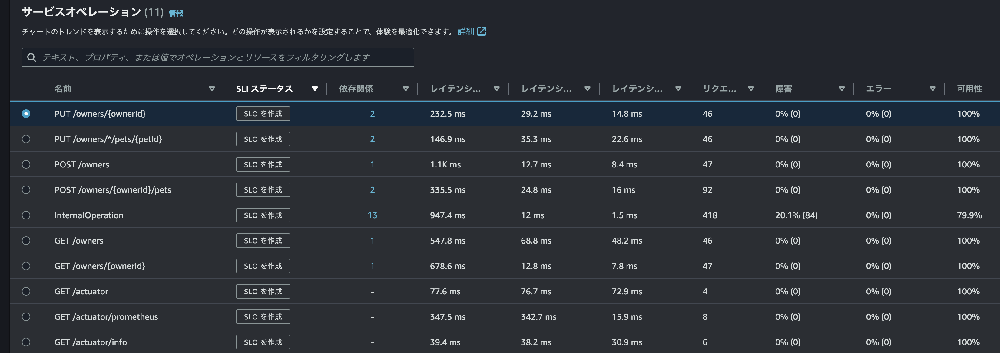
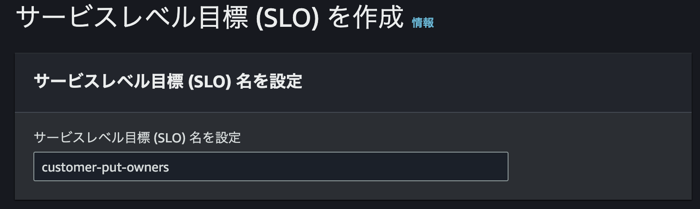
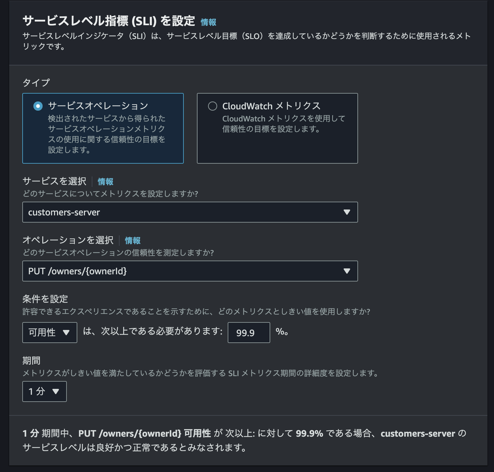
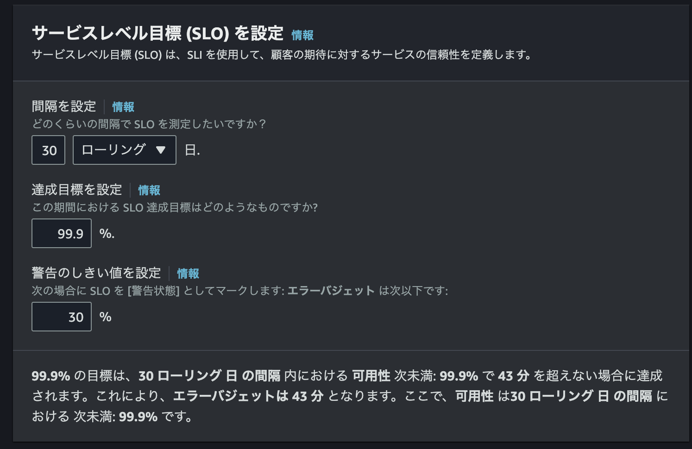
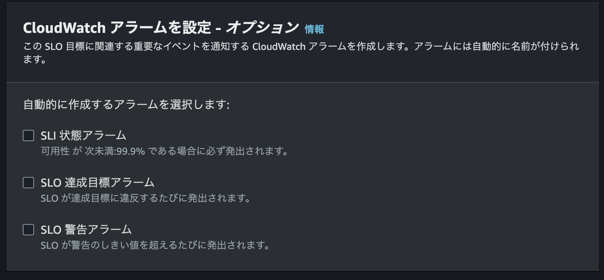
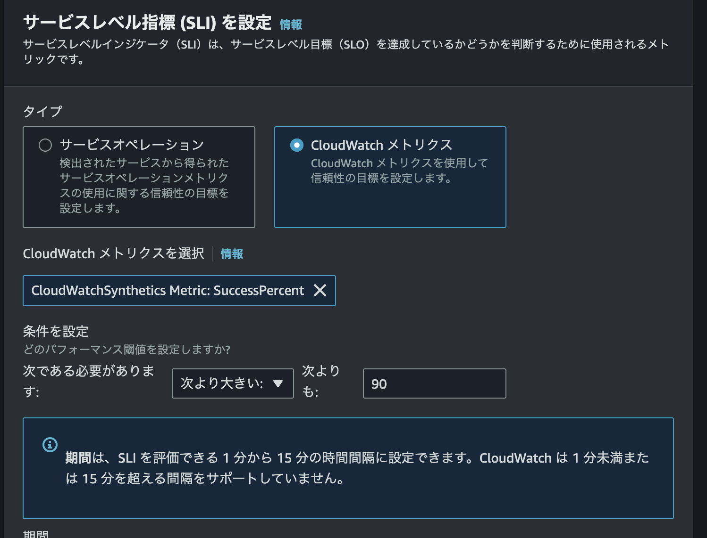

# Chapter 3

Chapter 3では複数のマイクロサービスのシグナルを受信し、そのなかから SLO を定義します。  

このハンズオンは [spring-petclinic-microservices](https://github.com/spring-petclinic/spring-petclinic-microservices/tree/main) のソースコードを利用しています。  
複数のマイクロサービスから成り立っており、かつ、Java アプリケーションということで OpenTelemetry (今回は Application Signals) のデモを行うのに適したものだと思っています。  

マイクロサービスの構成は本家のリポジトリにある通りです。  
※ 右側の Zipkin は無効にしています。  

  

## マイクロサービスのビルド

クローンしたリポジトリの `chap3` ディレクトリに移動します。  
```bash
$ cd ~/opsjaws-application-signals-handson/chap3
```

Docker イメージをビルドします。  

```bash
$  ./mvnw clean install -PbuildDocker 
(出力省略)
[INFO] spring-petclinic-microservices ..................... SUCCESS [  0.346 s]
[INFO] spring-petclinic-admin-server ...................... SUCCESS [ 17.074 s]
[INFO] spring-petclinic-customers-service ................. SUCCESS [ 23.000 s]
[INFO] spring-petclinic-vets-service ...................... SUCCESS [ 17.259 s]
[INFO] spring-petclinic-visits-service .................... SUCCESS [ 16.376 s]
[INFO] spring-petclinic-config-server ..................... SUCCESS [ 12.739 s]
[INFO] spring-petclinic-discovery-server .................. SUCCESS [ 22.525 s]
[INFO] spring-petclinic-api-gateway ....................... SUCCESS [ 31.931 s]
## 全て SUCCESS になっていることを確認
(出力省略)
```


## コンテナ起動

ビルドが正常終了したならば、コンテナを起動します。  

```bash
$ docker compose up -d
$ docker compose ps -a
## STATUS が全て Up になっていることを確認
```


## Synthetic Canary の作成

作成したマイクロサービスに対して Synthetic Canary を作成します。  
スクリプトを利用して作成します。  

```bash
$ TOKEN=`curl -X PUT "http://169.254.169.254/latest/api/token" -H "X-aws-ec2-metadata-token-ttl-seconds: 21600"` 
$ ENDPOINT="http://$(curl -H "X-aws-ec2-metadata-token: $TOKEN" http://169.254.169.254/latest/meta-data/public-ipv4):8080"

$ chmod +x create-canaries.sh
$ ./create-canaries.sh ap-northeast-1 create $ENDPOINT
```

## Application Insights の確認

コンテナ起動、Synthetic Canary 作成から5分待ちます。  

マネジメントコンソールの CloudWatch 画面から、左ペインの **X-Ray トレース** → **トレース** を選択します。  
Chapter 2同様に複数個のトレースが確認できるはずです。  

## Service Map の確認

マネジメントコンソールの CloudWatch 画面から、左ペインの **Application Signals** → **Service Map** を選択します。  

マイクロサービス間での通信が確認できます。ある1つのマイクロサービスをクリックすると、レイテンシー、リクエスト、障害(5xx) が表示され、問題箇所の特定に役立ちます。  



## SLI 表示

マネジメントコンソールの CloudWatch 画面から、左ペインの **Application Signals** → **サービス** を選択します。  

いくつかのサービスが表示されます。  



**customers-server** をクリックしてみましょう。  

**概要** タブでは、サービスの健全性を一覧で確認できます。  

続いて **サービスオペレーション** タグを開きます。  
HTTP メソッドと API Endpoint の組み合わせでレイテンシー、リクエスト数、エラー数を確認できます。
ここを SLI として利用します。  

  

## SLO 作成 〜 サービスオペレーション

それでは SLO を作りましょう。  
2通りの SLO を作成してみます。まずはサービスオペレーションから。  

**サービスオペレーション** 画面のままです。  
`PUT /owners/{ownerId}` の横の **SLO を作成** をクリックします。  

### 名称

任意の名称を入力します。今回は「customer-put-owners」としました。  



### SLI

SLI を設定します。  
条件を可用性、または、レイテンシーから選択します。可用性の場合は率(％)、レイテンシーの場合はミリ秒で設定します。  

期間は評価する期間です。  

下部に説明文が表示されています。今回の例で良好とみなさせる条件です。  
実際はここを自分が管理しているサービスに最適なものにしてください。  

> 1 分 期間中、PUT /owners/{ownerId} 可用性 が 次以上: に対して 99.9% である場合、customers-server のサービスレベルは良好かつ正常であるとみなされます。



### SLO

SLO を設定します。  
ローリング、または、カレンダーから間隔を選択します。今回は「30日、ローリング」にします。  

達成目標は読んだままですね。間隔で設定した期間中、正常健全であると判定される目標値を設定します。  

警告のしきい値は、CloudWatch アラーム発報条件に使用できます。  

ここも下部に説明文が表示されています。SLO らしい説明です。  

> 99.9% の目標は、30 ローリング 日 の間隔 内における 可用性 次未満: 99.9% で 43 分 を超えない場合に達成されます。これにより、エラーバジェットは 43 分 となります。ここで、可用性 は30 ローリング 日 の間隔 における 次未満: 99.9% です。



### CloudWatch アラーム

CloudWatch アラームを設定します。説明不要かなと思います。  



`SLO を作成` をクリックします。

## SLO 作成 〜 可用性

サービスエンドポイントの可用性レベルを SLO として設定します。  

マネジメントコンソールの CloudWatch 画面から、左ペインの **Application Signals** → **サービス** を選択します。  

`アクション` から `SLO を作成` をクリックします。  

SLO 名は `pet-clinic-canary` とします。(任意なので変更しても構いません。)  

SLI は `CloudWatch メトリクス` を選択します。  

メトリクスは以下を選択してください。  

| 項目         | 設定値               |
| ------------ | -------------------- |
| 名前空間     | CloudWatchSynthetics |
| メトリクス名 | SuccessPercent       |
| CanaryName   | pc-visit-billings    |
| StepName     | navigateToUrl        |

条件は `90 よりも大きい` にします。  

  

<br />  
他の項目はデフォルト値のまま作成します。  

## 様々な SLO

前の手順を参考にして様々な SLO を作成してみましょう。  

- レイテンシーが 3ms 以下であること (99パーセンタイル)
  - 7日ローリング、目標は99%

- レイテンシーが 10ms 以下であること (90パーセンタイル)
  - ローリング期間を変えて3つの SLO を作ってみる
  - 7日ローリング、目標は99%
  - 30日ローリング、目標は99%
  - 365日ローリング、目標は99%

## 状態の変化を観る

意図的に障害を起こし、SLO の状態が変化するのを観察してみましょう。  

- セキュリティグループの 8080 を閉じてみる
- EC2 インスタンスに負荷をかけてみる
- マイクロサービスを1つ停止してみる (`docker compose down vets-service`)

## Synthetic Canary の削除

一通りの検証が完了したら Canary を削除します。  

```bash
$ ./create-canaries.sh ap-northeast-1 delete $ENDPOINT
```

## コンテナ停止

一通りの検証が完了したらコンテナを停止します。  

```bash
$ docker compose down
```


## Thanks

このハンズオンは [spring-petclinic-microservices](https://github.com/spring-petclinic/spring-petclinic-microservices/tree/main) のマイクロサービス群を利用しています。ありがとうございます。  


<br />

[目次へ戻る](./README.md)  
[クリーンアップへ](./chap4.md)  